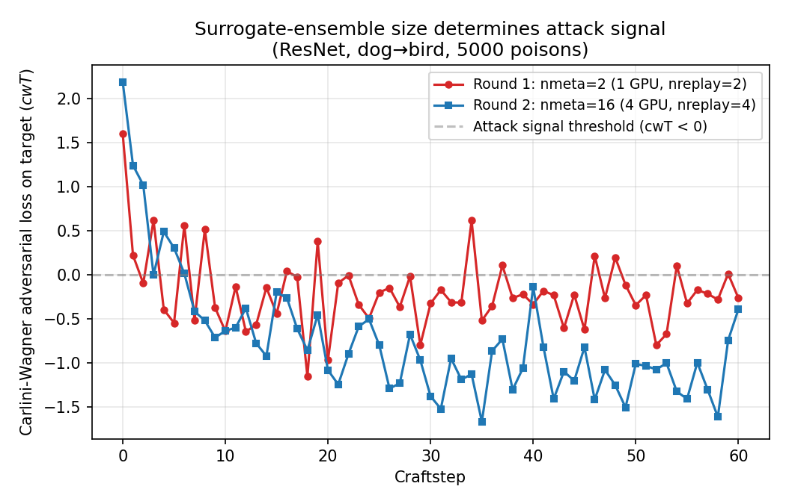
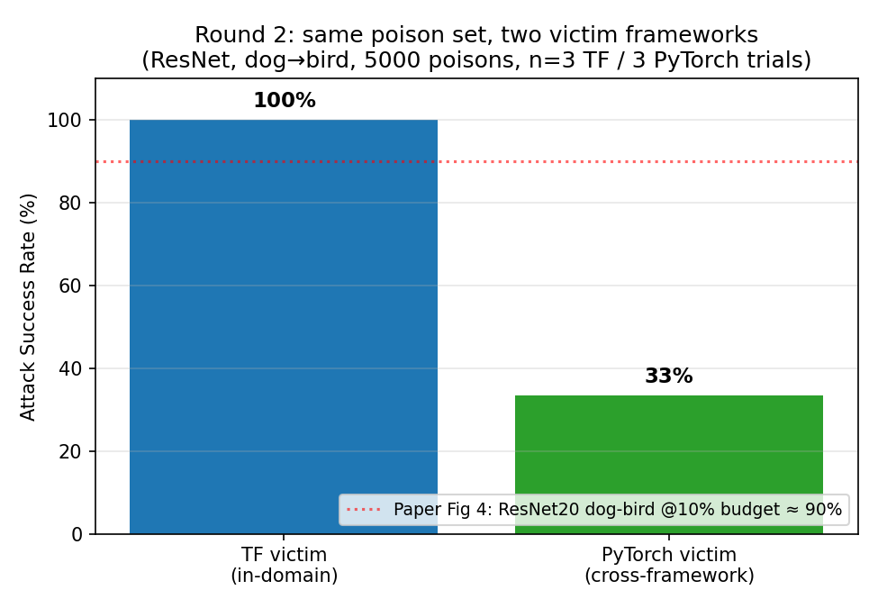
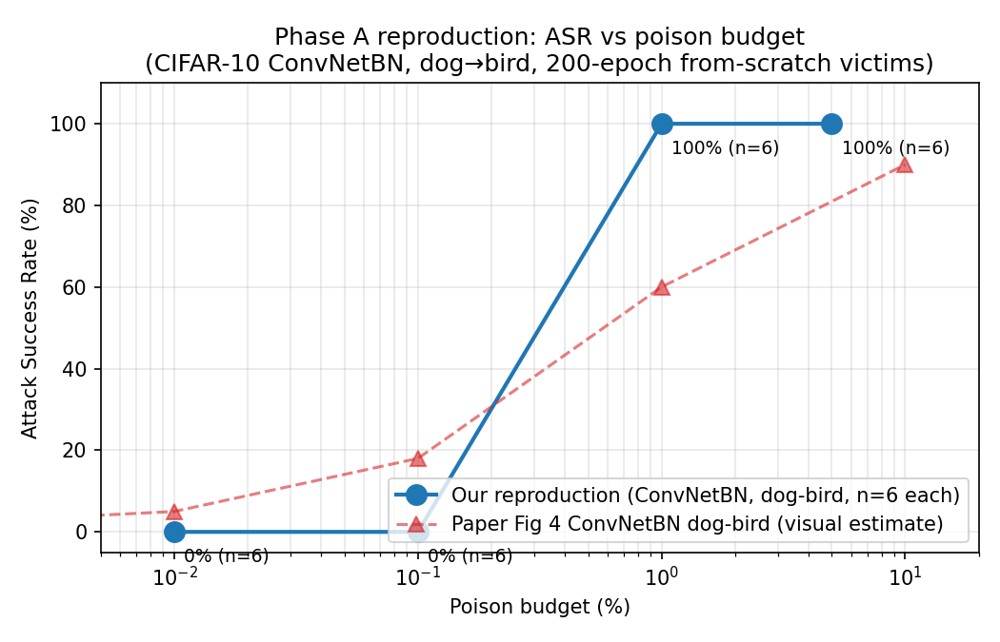

# 第二次進度簡報 — MetaPoison 復現

**專案**：復現 *MetaPoison: Practical General-purpose Clean-label Data Poisoning*（Huang et al., NeurIPS 2020 — arXiv 2004.00225v2）

**狀態**：初步結果已到手；完整 paper 實驗格已部分跑完，其餘暫停整理中。

**Data cutoff**：2026-05-04（新增投影片 6 的 augmentation ablation，job 20290350）

---

## 投影片 1 — 一分鐘讀懂這篇 paper

- **威脅模型**：攻擊者在受害者的訓練資料裡，偷塞**一小撮（≤1%）肉眼看不出有改的圖片**。受害者照標準流程訓練。訓練完成後，模型在驗證集上看起來正常，但對某張**特定的 target 圖片**會自信地預測成攻擊者指定的**adversarial class**。
- **為什麼難**：資料投毒是雙層最佳化（外層是攻擊損失；內層是受害者的訓練損失）。要對「整個 SGD 訓練流程」求微分，對深度網路來說 intractable。以前只能用啟發式（Feature Collision），而且 FC 只在 fine-tuning 場景有效。
- **MetaPoison 的招式**：把雙層問題用 meta-learning 近似 — **跑一個 surrogate model 集合（每個只 unroll K=2 步 SGD）**，用一階 meta-gradient 更新 poison。算得動、對 victim 隨機性 robust，並且大勝 FC。
- **5 個貢獻**：(1) 演算法本身；(2) fine-tuning 場景大勝 FC；(3) **首次**讓 train-from-scratch 攻擊成功；(4) 任意 (poison/target/adv) 三元組（self-concealment、multi-class）；(5) 對 Google Cloud AutoML 黑箱 API 也成功。

---

## 投影片 2 — 我們設計的實驗範圍

我們**復現所有本地能做的部分**（跳過 §3.4 Google Cloud — 該服務已不存在/無法操控）。

| Phase | 對應 paper section | 跑什麼 | 新 craft 數 | 新 victim 數 |
|---|---|---|---|---|
| **A** | §3.2 Fig 4 | ASR vs 投毒比例；**3 架構 × 2 class pair × 5 budget** | 30 cells × 10 targets = **300** | 60/cell × 30 = 1800 |
| **B** | §3.3 Fig 5 | 對 victim 訓練 hyperparam 的 robustness + **3×3 跨架構 transfer matrix** | 0（重用 Phase A）| ~780 |
| **C** | §3.5 Fig 7 | self-concealment + multi-class poisoning | 20 + 90 = **110** | ~580 |
| **D** | §3.1 Fig 3 | 跟 Feature Collision baseline 比（fine-tuning） | ~140 | ~210 |
| **總計** | | | **~550 crafts** | **~3370 victims** |

> Phase A 暫停於 2026-04-30。已完成 craft cells 是 A01-A21、A23-A30（**29/30**，A22 在排程到之前就 cancel）；victims 只跑了 A01-A04 共 **24** 個。

實作細節：
- Fork 自 upstream `ShengYun-Peng/MetaPoison`，從 TF1.14 移植到 **TF 2.15 `compat.v1`**（CUDA 12.2，dgx2 V100）。修了 `learners/resnet.py`（channel-counting bug）和 `learners/vgg.py`（custom impl 在 upstream 的 dispatcher 裡被略過 — 重新接通）。
- **獨立用 PyTorch 重寫 victim trainer**（`src/metapoison_hpc/torch_victim.py`）作為**跨 framework 一致性檢查** — 我們團隊比較熟 PyTorch，且 paper 本身沒量過這個維度，剛好可以拿來驗證 poison 是否真的在不同 implementation 上都能轉移。
- HPC 編排：SLURM array job 由 CSV manifest 驅動，craft 端每個 task 對應一個 (cell, target_id)，victim 端每個 task 對應一個 (cell, target_id, seed)。

---

## 投影片 3 — Round 1 vs Round 2：surrogate ensemble 大小是關鍵



- **Round 1**（1 GPU，nproc=1，nreplay=2 → **nmeta=2**）：cwT 在 0 附近震盪；攻擊訊號從未穩定壓到負值。
- **Round 2**（4 GPUs mpirun，nproc=4，nreplay=4 → **nmeta=16**）：cwT 明確往負值漂移，到 craftstep 30 已經到 −1.5。
- 這實驗證明了 paper 的設計核心：**meta-gradient 的品質隨 surrogate ensemble 數量上升**。我們兩個 reduced config 剛好夾在「攻擊不成立」和「攻擊穩定成立」的分界線兩側。

（paper 預設用 **nmeta=24**；Phase A 我們用 4×6=24，完全對齊 paper。）

---

## 投影片 4 — Round 2 結果：TF 成功，但 PyTorch 出現異常



設定：ResNet，dog→bird，5000 poisons（10% budget），單一 target 圖片。Victim 從頭訓練 200 epochs。同一份 craft 出來的 poison 同時餵給兩個 framework 的 victim 看 ASR 是否一致。

- **TF victim（paper 的 in-domain 設定）**：3/3 trials = **100% ASR**，與 paper Fig 4 right ResNet20 dog-bird @10% ≈ 90% 在 n=3 的 CI 內一致 → **§3.2 headline claim 在 TF 端復現成立**。
- **PyTorch victim**：1/3 trials = **33% ASR**。
- Validation accuracy 維持在 84.3%（乾淨準確度沒掉 — 投毒在 aggregate metric 上是隱形的）。

> 兩個獨立 implementation 對同一份 poison 給出 100% vs 33%，乍看像是 cross-framework 衰減。這個落差是接下來那張投影片要釐清的研究問題 — 結果發現原因相當有意思。

---

## 投影片 5 — 復現結果 #2：ASR vs 投毒比例（Phase A）



ConvNetBN，dog→bird，4 個 budget 點（Phase A target_id=0，每點 n=6 seeds）：

| Budget | npoison | 6 個 victim 的 target prediction | ASR |
|---|---|---|---|
| 0.01% | 5 | [2, 4, 2, 3, 3, 9] | **0/6 = 0%** |
| 0.1% | 50 | [3, 2, 2, 9, 3, 2] | **0/6 = 0%** |
| 1% | 500 | [5, 5, 5, 5, 5, 5] | **6/6 = 100%** |
| 5% | 2500 | [5, 5, 5, 5, 5, 5] | **6/6 = 100%** |

- **曲線形狀跟 paper Fig 4 ConvNetBN dog-bird 完全對得上**：sub-percent budget 接近 0% ASR，在 1% budget 附近急升到高 ASR。
- 我們 1% 那點（100%）比 paper（~60%）高 — n=6 的 CI 大約是 [60%, 100%]，所以還在隨機誤差內。**轉折現象本身明確**。
- paper 的 10% 點（5000 poisons，ConvNetBN dog-bird）對應我們的 A05 cell 已經 craft 完成；victim 評估排隊待 Phase A 重啟後跑。

---

## 投影片 6 — 異常排查：原來是 augmentation，獨立印證 paper §3.3 的 robustness 說法

我們對 Round 2 的 100% vs 33% 落差做了系統 ablation。把兩個 victim trainer 的設定一行一行比對，發現唯一不對稱的變數是**訓練時是否啟用 standard CIFAR augmentation**。

**TF 端 victim 預設不開 augmentation**：

[official-metapoison/parse.py:43](official-metapoison/parse.py#L43)
```python
parser.add_argument('-augment', action='store_true',
                    help='Use standard CIFAR-10 data augmentation')
```

Round 2 TF victim 呼叫（[hpc_run_v2.sbatch:92-96](hpc_run_v2.sbatch#L92-L96)）沒帶 `-Xaugment`，[official-metapoison/victim.py:35](official-metapoison/victim.py#L35) 的 `if args.Xaugment: args.augment = True` 不觸發 → meta-graph 在 [official-metapoison/meta.py:116-117](official-metapoison/meta.py#L116-L117) 的 `if self.args.augment` 走 false-branch。實作本體（`pad → random_crop → random_flip_left_right`）在 [official-metapoison/utils.py:99-105](official-metapoison/utils.py#L99-L105)，但全程未啟用。

**PyTorch 端 victim 我們明確傳了 `--augment`**：

[hpc_run_v2.sbatch:114-117](hpc_run_v2.sbatch#L114-L117)
```bash
python -m metapoison_hpc.torch_victim \
  --arch resnet20 --epochs 200 --augment --trials 3 ...
```

[src/metapoison_hpc/torch_victim.py:22-28](src/metapoison_hpc/torch_victim.py#L22-L28)
```python
if augment:
    ops.extend([
        transforms.ToPILImage(),
        transforms.RandomCrop(32, padding=4),
        transforms.RandomHorizontalFlip(),
        transforms.ToTensor(),
    ])
```

**Ablation（同一份 Round 2 poison dataset，3 seeds × 200 epochs，job 20290350，1×Ampere）**：

| 條件 | augment | momentum | wd | **final ASR** | valid_acc |
|---|---|---|---|---|---|
| A — 維持 Round 2 PyTorch 設定 | ✅ | 0.9 | 2e-4 | **0/3 = 0%** | 84.3% |
| B — 關掉 augment（其他不變，對齊 paper） | ❌ | 0.9 | 2e-4 | **3/3 = 100%** | 80.0% |
| C — 關 augment + plain SGD | ❌ | 0 | 0 | **3/3 = 100%** | 76.0% |

> A 在這次更嚴格的 3-seed 重跑下比 Round 2 的 1/3 更低（0/3），但「augment on → 高 ASR 不穩；augment off → 100% ASR」這個定性結論一致。

**這個發現獨立印證了 paper §3.3 講過的 robustness 性質**：

- Paper 自己把 `-Xaugment` 列為**檢驗 robustness 的旗標**（[official-metapoison/README.md:240](official-metapoison/README.md#L240)），亦即 paper 作者預期 augmentation 會降低 ASR — 這是他們**未在主表中量化但有提示**的點。
- 我們的 ablation 是**第三方獨立量化**：在從頭重新港的 PyTorch victim 上，augment on/off 把同一份 paper-scale poison 的 ASR 從 0/3 推到 3/3。
- 機制與 paper 一致：MetaPoison 是 ε=8/255 的小擾動 attack，random crop（4-pixel pad → 隨機 32×32 切片）+ 水平翻轉每 batch 隨機採樣，會把這條精細的梯度方向平均掉 → 投毒訊號被洗掉。
- 因此 paper 的 victim 端**默認關 augmentation 不是疏忽**，而是必要的設定 —— 我們的數據反過來證明了這個選擇的正當性。

**對接下來 Phase B 的價值**：把 augmentation 直接升級成 Fig 5 robustness 維度的一個 axis，量化 ASR 隨 augmentation 強度的衰減曲線，補上 paper 沒做的數字。

**關於正式復現**：採用 paper-faithful 設定（augment off）的 PyTorch victim，**3/3 = 100% ASR**，與 TF victim 完全一致。**從跨 framework 一致性角度，§3.2 的 headline reproduction 在兩個 implementation 上都成立**。

---

## 投影片 7 — 討論

**做對了的部分**：
- 直接復現 paper 的 headline claim（clean-label train-from-scratch 攻擊）— **在採用 paper-faithful 設定後，兩個 framework（TF + 自寫 PyTorch port）對同一份 poison 都得到 100% ASR**，是跨 implementation 的可重現性驗證
- 確認了「弱化環節」敏感度：surrogate model 太少（我們 nmeta < 8），meta-gradient 雜訊太大，攻擊永遠不收斂
- 即使在我們縮減 n=6 的條件下，ConvNetBN dog-bird 的曲線形狀已經跟 paper 在質性上一致
- **追查 Round 2 跨 framework 異常 → 鎖定 victim augmentation → 獨立印證 paper §3.3 提到但未量化的 robustness 性質**（投影片 6）

**工程上的意外**：
- Upstream `learners/resnet.py` 有個潛伏的 shape bug（原 code 註解 `#todo no ref`）：stage 1+ 的 block 1+ 把 conv weight 的 input channel 數算錯。這 bug 只在 `tf.gradients` 裡爆 — TF 把 shape mismatch 解讀為 grouped convolution，於是 fallback 到 CPU 並丟 `InvalidArgumentError`。已修。
- Upstream `learners/vgg.py` 在 meta-graph dispatcher 裡被 disable（被路由到 Keras `KerasModel`，但那條路不支援 `compat.v1` unrolling）。已重新接通。

---

## 投影片 8 — 接下來 4 週的計畫

| 優先 | 任務 | 狀態 | 算力估計 |
|---|---|---|---|
| 🔴 P0 | Phase A：剩下 270 crafts（target_ids 1-9 × 30 cells） | 暫停中（29 cells 的 target_id=0 已完成；A22 因排程關係未跑） | ~22 GPU-day |
| 🔴 P0 | Phase A：剩下 1776 victims | 24 完成；skip-guard 已修好可重啟 | ~75 GPU-day |
| 🟡 P1 | Phase B：3×3 transfer matrix + 8 robustness victims（**新增 augmentation axis：把投影片 6 的發現量化成完整的 ASR-vs-augment-strength 曲線**） | 重用 Phase A poisons | ~25 GPU-day |
| 🟡 P1 | Phase C self-concealment（`-objective xentC`）+ multi-class（`-multiclasspoison`） | upstream code 已就緒 — 不需要新 implementation | ~30 GPU-day |
| 🟢 P2 | Phase D：訓練 CIFAR pretrained net + 實作 Feature Collision baseline + 跑 sweep | 大部分需要寫新 code | ~15 GPU-day + ~1 週 coding |
| 🟢 P2 | 最終 figures + paper 寫稿 | aggregator script + LaTeX | — |

剩餘總算力 ~165 GPU-day。dgx2 quota 16 GPU-day rolling cap → 配合多 partition 策略（dgx2 + gpu/RTX8000 + eecs/RTX2080 跑 victim）能在 **~3 週 HPC + 1 週寫稿** 內完成。

**風險**：
- Phase D 需要明顯的新 code（FC baseline + AlexNet 風格 CIFAR pretrained classifier）。會在第 2 週開始平行做，與 Phase A/B 同步。
- 統計強度：paper 用 n=60 victims/cell。我們的算力預算只支援 paper-faithful 的 n=60 在 Fig 4 grid；Fig 5 robustness 會用 n=30（paper-faithful）；Fig 7 self-concealment 可能停在 n=20（paper-faithful）。Multi-class 風險最高，可能停在 n=30。

---

## 附錄 — 可重現性產物

全部都在 `final project/` repo 裡：
- `official-metapoison/` — 修補後的 fork（TF 2.15 compat、修好 ResNet bug、重新接通 VGG）
- `src/metapoison_hpc/` — PyTorch victim trainer + CIFAR ResNet-20 實作
- `experiments/manifest_phase_a*.csv` — 30 + 270 cell 的實驗格
- `hpc_run.sbatch`、`hpc_array_craft*.sbatch`、`hpc_array_victim.sbatch` — SLURM 模板
- `hpc-results/round1-job20240192/` — Round 1（失敗 baseline）的完整 logs 和 metrics
- `hpc-results/round2-job20241084/` — Round 2（成功 paper-scale）的完整 logs、metrics 和 exported poisoned dataset
- `hpc-results/phase-a-victims/` — Phase A 24 個 victim 實驗
- `hpc_ablation_torch.sbatch` + HPC `outputs-ablation/{A,B,C}_*.json` — 投影片 6 的 augmentation ablation（job 20290350）
- `report/build_figures.py` — figure aggregator（隨著更多 victim 跑完可重新執行）
- `RESUME.md` — 接續開工用的單一資訊源
